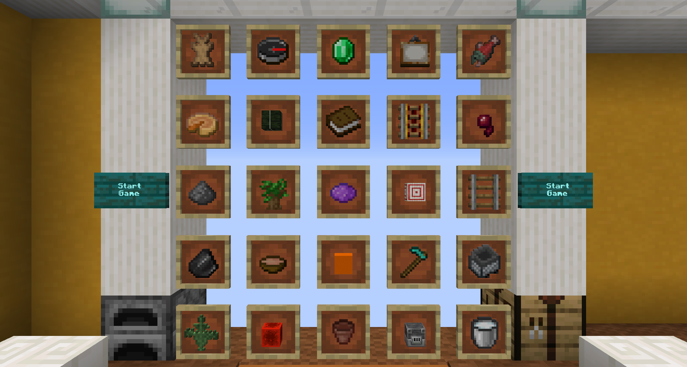
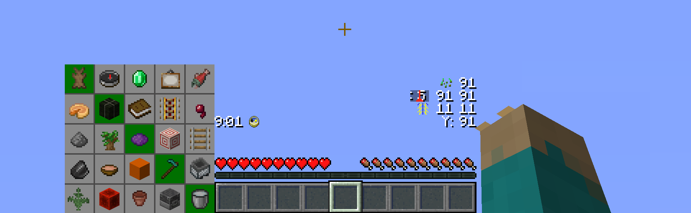
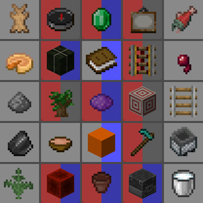
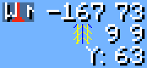
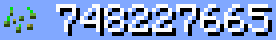

# Fetchr
Fetchr is a custom gamemode where you play in survival Minecraft with a 5x5 Bingo board.

Try to collect all 5 items in a line for a quick Bingo or all 25 items for a longer Blackout game as quickly as possible!

Example of a Bingo Card as shown in the Fetchr lobby:  

## General information

Fetchr / Minecraft Bingo is quite a simple concept as it builds ontop of the vanilla survival gameplay. You will start with an empty inventory at a random, unknown spawn point within the world and get an experience similar to starting a new survival world.

Your goal is to get items from the Bingo Board. There are multiple goals that are detected by the pack:

- **Bingo**: All 5 items in any of the rows, columns, or diagonals
- **Blackout**: All 25 items on the board
- **20 No Bingo**: Get 20 items while avoiding any Bingo. This is the maximum number of items that can be obtained without triggering a Bingo and requires careful planning
- **Multi Bingo**: Obtain multiple Bingos at once. This can be accomplished by obtaining items of two intersecting lines and getting the item at the intersection last, effectively unlocking a combination of 2-4 rows, columns and/or diagonals at once.

You may also play in either (or both at the same time):
- **Lockout Mode**: Only one team can obtain each item, locking other teams out from scoring it. Once a team has obtained more items than any other team still can, this team will win.
- **Blind Mode**: The card is not visible and items get revealed as any player gets them. Knowing possible items and mutual exclusivity from the category chests is expected for this mode.

The map will always detect all goals. Don't worry when a Bingo is announced while you want to go for a blackout - just keep going, there is no automatic mechanism that ends the game before you desire to do so.

## Download and Installation

You may also download from [CurseForge](https://www.curseforge.com/minecraft/worlds/fetchr).  

### Singleplayer
1. Download the world file called `Fetchr-<version>.zip` from [the release page](https://github.com/NeunEinser/bingo/releases/latest)
2. Extract/unzip it to your Minecraft saves directory.
3. Make sure you are using the correct Minecraft Version (currently 1.20.2)
4. When you start Minecraft, you should now find the Fetchr map right at the top of your worlds. Just open the map now. You do not need anything else.

### Multiplayer
1. Download the world file called `Fetchr-<version>.zip` from [the release page](https://github.com/NeunEinser/bingo/releases/latest)
2. Make sure you are using a supported version (currently 1.20.2, vanilla, or Fabric with Lithium. Paper/Spigot are **not** supported and may break the map in subtle ways)
2. Extract/unzip it in the same directory as your `server.jar` file is located.
3. Make sure the `server.properties` file is set according to the server.properties file attached to [the release](https://github.com/NeunEinser/bingo/releases/latest)
   - If you already have a custom server.properties, make sure all the settings mentioned in that file are set correctly.
   - If you don't have a custom `server.properties` override it with that file. When the server starts, all missing settings will be filled with default values
5. Start the server - everything is setup now.

## Detailed Feature Overview

### Custom HUD

While in-game you will have a bunch of custom HUD elements around your hotbar. This utilizes a custom font and does not require any mods.

The HUD can be customized in the Lobby and elements can be moved however you prefer them to be layed out, or individual components can be removed.

#### Bingo Card

The Bingo card shows all items of the current game and a summary of which team obtained which item so far. Items your own team has already gotten appear a little bit darker. Depending on the amount of teams, this display will be adjusted to fit all teams in.

From the lobby, 10 team colors are available.

#### Timer

There is a timer that counts up. This allows you to keep track of your time without any third party software. There is no time limit imposed by the map, but you can of course set your own goal. The timer counts real time. The timer icon also represents a functional Minecraft clock, showing the time within the current day

#### Player position

There is a player position visible which shows the coordinates relative to the spawn point. The coordinates on your F3 screen will be extremely high and hard to parse / communicate, due to the random spawn point. The icon also functions as a regular compass and can be changed to appear like the Minecraft compass icon via the preference settings.

Below the regular coordinates, there is by default also a chunk coordinate display. This is useful during certain times, for example when following a treasure map, the treasure will always be located at chunk coordinates 9 9

And below that, there is also a separated Y coordinate display, which is useful when digging down without requiring F3.

#### Fetchr Seed

Finally, there is a visible display for the Fetchr seed. Like a Minecraft world, where the same seed will generate the same world, the same Fetchr seed will generate the same Bingo Board and the same spawn point. When generating a card, you can choose to manually set a seed instead of generating a random card for competitive races or set-seed runs.

### Custom Worldgen

Fetchr uses custom Worldgen to make certain items more reliable in a Bingo run.

#### Compressed World

Biome sizes are decreased to make finding biome-specific items more fun and reliable, and structure frequencies are increased.

#### No Nether

Owing to technical limitations with custom worlds, the Nether is disabled.

#### No Ites

All stone variants that end in -ite have been disabled from generating. This includes diorite, andesite and granite. This was done as a qol change to reduce inventory clutter and make digging for stone consistent.

Granite may still generate as part of copper ore veins.

### Ambient lighting

There is a constant lighting factor in the overworld, similarly to the vanilla Nether. This allows seeing in caves clearly without torches.

### Game Rule changes

- Weather is always sunny
- Phantoms, wandering traders and patrol spawns (which all work on a world-global timer) are disabled

## Guides
- [Modifying the item pool](docs/modifying_item_pool.md)

## Credits

Original idea and 1.11 implementation by Lorgon111: http://www.playminecraftbingo.com/

### Code Contributors

NeunEinser - Main / Lead developer  
Kri5t0fK  
UnlucksMcGee

### Translators

German by NeunEinser, gbegerow and LawrenceB  
Polish by Kri5t0fK  
Italian by Loweredgames  
Dutch by ThomasToSpace  
Portuguese (Brazil) by Draacoun  
French by Aurélien  
Spanish by Alvaro Orrego and HolaSoyElmo  
Chinese (simplified) by 雨夢 YoMon and Sora

## Contributing

Feel free to work on any issue and make Pull Requests.  
All functions should be documented using [IMP doc](https://github.com/SPYGlassMC/SPYGlass/wiki/IMP-Doc).  
It is recommended to use the VS code extension [Datapack Helper Plus](https://marketplace.visualstudio.com/items?itemName=SPGoding.datapack-language-server). There are some custom settings in this repository that will automatically be applied to your repository and ensure you follow my conventions.

### Translating

Translations are hosted on [Crowdin](https://crowdin.com/project/fetchr). Any contributions are appreciated.

If your lanuguage is missing, get in touch, and it can be added.

See [Translation Help & Guidelines](https://crowdin.com/project/fetchr/discussions/7) for more information.