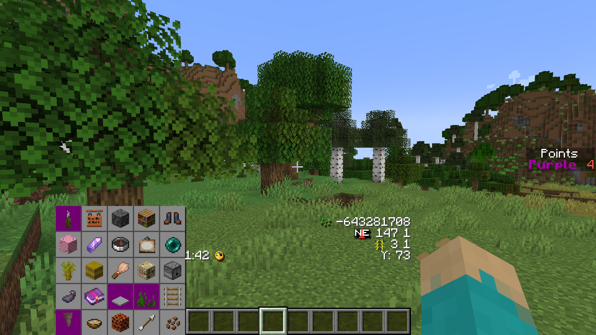
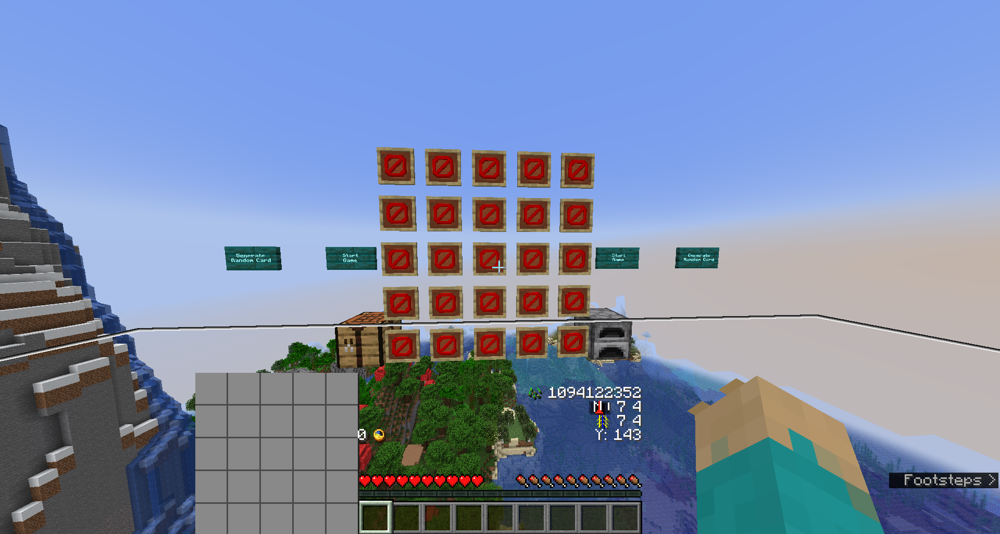
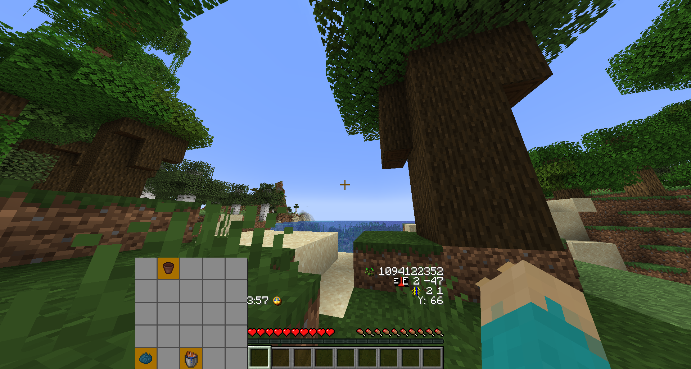
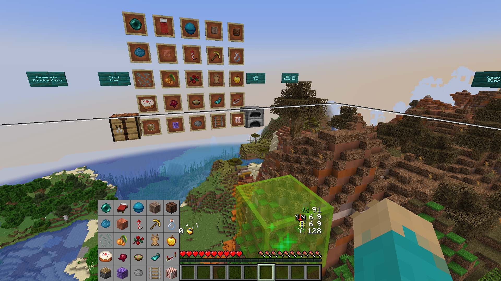
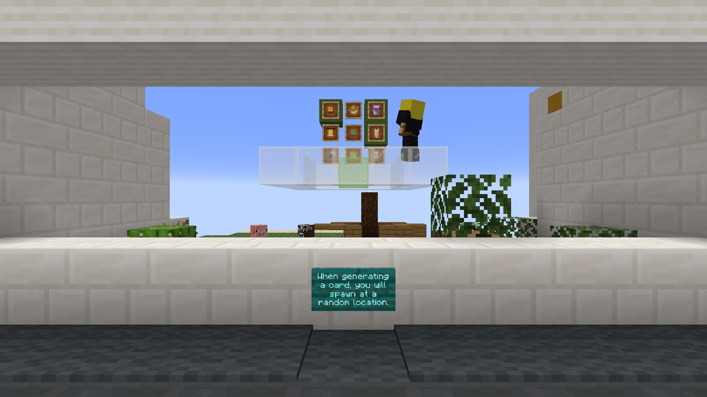
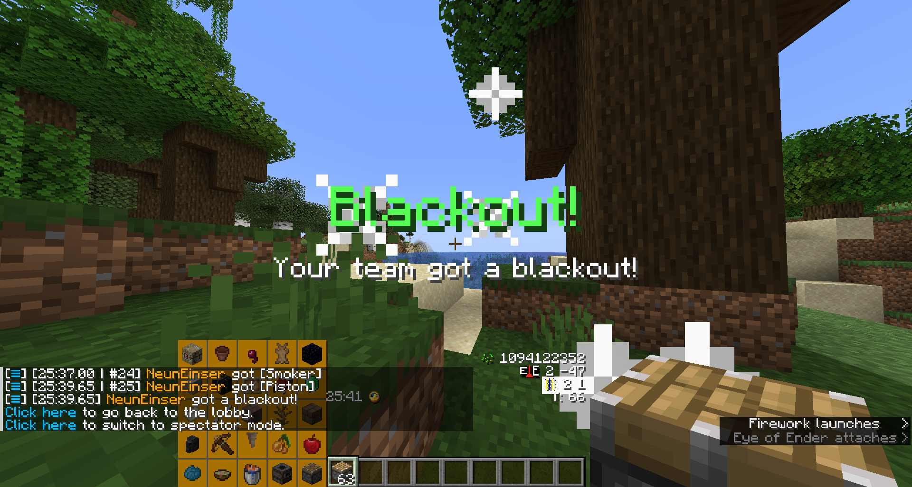

# 5.2.1
5.2.1 is released to address a critical bug in 5.2 that could cause spawn points
to be swapped and mangeled after playing multiple runs. You are higly encouraged
to update.

This version is fully compatible with 5.2, meaning you can keep the same server
config and just replace the datapack without replacing the world.

## Bug Fixes
- Fixed spawn marker not being cleared properly after a run, causing
spawn points to be potentially swapped and messed up.

# 5.2
5.2 updates the map to 1.21, brings new items, and a few improvements

## Changelog
- The targeted Minecraft version is now 1.21-1.21.4
- Added new items and changed categories of existing items
- Worldgen Tweaks
- Armadillos are more common to generate in savanna biomes compared to vanilla
- Items taken from the game that include an inner inventory now return their
inventory to the player
  - This includes bundles, shulker boxes and loaded crossbows
- Item get messages in chat now contain a tooltip with the exact item that was
taken
- Improved category chest
- Improved big lobby & skybox card interaction
- Creepers and tnt no longer cause damage in the lobby
- Technical Improvements and better Performance
- Removed machinery as command blocks are no longer necessary
  - Command blocks are no longer required to be enabled in a server environment
- Updated translations from Crowdin
- 1EEFEzBzXBZzUPzCSJOHzNPSFzNPCTzUPzUIFzMPCCZAz3BNFMT1SFiIF2FTUAz7PzUPzUIFzHJUIVCAz7PzUPzDPEFAz3MJDLzPOzUIFzJNBHFTzEJSFDUPSZAziBLFzBzMPPLzBUzuArAz8PQFzUIJTzIFMQTAzLBZzCZF
  - sorry this got corrupted
  - dont worry about it
  - possible characters are `[a-zA-Z0-9 .]`

## Item Changes

### Roots
New category "Roots" with:
- Carrot
- Golden Carrot
- Carrot on a Stick
- Baked Potato

### Armadillo
New "Armadillo" Category with:
- Armadillo Scute
- Wolf Armor

### Pale Garden
New category "Pale Garden"  
These items are only available when playing in 1.21.4

- Pale Moss Block
- Closed Eyeblossom
- Open Eyeblossom
- Pale Hanging Moss (also mutually exclusive with shear items)
- Resin Clump (also mutually exclusive with nighttime mob drops)
- Chiseled Resin Bricks (also mutually exclusive with nighttime mob drops)
- Creaking Heart (also mutually exclusive with nighttime mob drops)

### Other new items
- Jungle Sapling as part of the jungle category
- White Stained Glass exclusive with glass bottle and orange concrete
- Brown Banner as part of the wool category
- Light Blue Bundle as part of the leather category
  - This is only active in 1.21.2 or higher
- Added Poison arrow which splits its weight with slowness arrow

### Changes
- Book items have been separated from the leather category and are no longer
  exclusive with item frames
- Tnt and Tnt Minecart are no longer exclusive with glass bottle and orange
  concrete
- Saplings are no longer mutually exclusive
  - Mangrove propagule is exclusive with mud items
  - spruce sapling is exclusive with sweet berries, fern and snow
  - acacia is exclusive with cactus green, lime dye and sea pickle
  - dark oak is exclusive with apple and golden apple

### Removed Items
- Birch sapling
- Golden hoe, golden pickaxe
- Diamond shovel, diamod axe, diamond sword

The variety in gold and diamond tools was reduced to make blind runs need to
craft fewer of them.

## Lobby & Skybox
- The machinery is gone, as command blocks are no longer needed
- Removed the floating property in front of the big lobby & skybox card
- The reach to interact with item frames and other entities is now increased
while in the lobby or skybox.
- Item chests in the lobby now show the global item weight.
- Item chests in the lobby now generate with scaffolding and make the room grow
in height depending on the item pool (without pale garden items, the room is
shorter, for example.)

## Worldgen Tweaks

-  Buried treasure is now more common like other structures
  - This means map chests are now less likely to have no map
  - Buried treasure will generally be closer to their map
- Pillager outposts now require less distance from villages
- Trial chambers are more common, just like other structures in Fetchr
- Creaking heart frequency in pale oak trees has been increased compared to
vanilla from 10% to 35%

## Technical Changes
- Overhauled item registration card generation and item detection with new
  Minecraft Features in Mind such as Macros

### Item Registration
Item registration has been overhauled and existing forks that change the item
pool will need to update to the new system.

- `textComponent` has been removed
- `clearCommand` has been removed
- `detectCommand` has been removed
- `icon` is no longer a text component and instead the 4 digit hex code of the
  unicode character representing the item on the HUD bingo card
- `icon_font` specifies a own custom font to use for this item. Can be used to
  avoid conflicts in the vanilla Fetchr font files when maintaining forks
  - `actionbar` A list of 5 font definitions to use for the card displayed in
    the actionbar. Each definition is for a different row on the Bingo card
	 and needs to have the corresponding ascend value set. Reference the vanilla
	 Fetchr assets.
- `translation` New property for the translation key of the item
- `item_tests` Optional. Can be used for custom item tests.
  - `type` see blow
  - Type specific fields (see below)

#### Item Tests
Item tests can be used to further specify an item or override default behavior.
By default, any item in the `item` field will match, including any defined
components.

If `item_tests` is specified the components of the item definition will be
ignored for testing purposes and only be used to construct a display item
for the item frame card or the category chests.

- **`fetchr:component`**  
  A component the item must have exactly like specified.
  - `id` The data component id
  - `component` The component value
- **`fetchr:negated_component`**  
  A component the item must not have
  - `id` The data component id
- **`fetchr:predicate`**  
  An item sub predicate that must succeed for the item
  - `id` The item sub predicate type
  - `predicate` The predicate data

At runtime, this will be parsed together with the item id into a command item
argument.

For example this definition would leather boots with a blue shaper trim which is
not shown in the tooltip and a custom lore text whenever it is displayed, and
any leather boots that have any kind of blue trim would match:
```js
{
	item: {
		id: "minecraft:leather_boots",
		components: {
			"minecraft:trim": {
				pattern: "minecraft:shaper",
				material: "minecraft:lapis",
				show_in_tooltip: false
			},
			"minecraft:lore": [
				'{"translate": "item.minecraft.smithing_template.upgrade", "color": "gray", "italic": false}',
				'[" ", {"translate": "fetchr.item.description.any_trim", "color": "#406d95", "italic": false}]',
				'[" ", {"translate": "trim_material.minecraft.lapis", "color": "#406d95", "italic": false}]'
			]
		}
	},
	item_tests: [
		{
			type: "fetchr:predicate",
			id: "minecraft:trim",
			predicate: {material: "minecraft:lapis" }
		}
	]
}
```
When testing the item id together with the specified item tests would check for
`minecraft:leather_boots["minecraft:trim"~{material:"minecraft:lapis"}]`

### Renamed properties in storages
Properties in the item storage and the card storage have been renamed to follow
`snake_case` convention.

### Item Detection & Performance
The machinery room is obsolete now and has been removed. Item detection has
been fully implemented using macros and no longer needs any command blocks.

This should improve the performance quite significantly, as running command
blocks every tick was quite expensive.

Item detection now only runs for a player who had a change to their inventory
and does not have any active checks that run every tick anymore.

Command blocks are also more expensive because they parse their command
every time they are executed anew while functions are pre-parsed. Macro lines
still may need to be parsed more often, but because of macro caching, they will
only need to be re-parsed when a new card with different items is generated.
The cache only caches up to 8 unique combinations of arguments per function file
which means some functions have been duplicated to take advantage of the cache
for 25 items. There will still be a small performance overhead for cache lookup.

### Card Generation
Card generation also could be simplified using macros. Furthermore, there is no
custom random number generator in place anymore, and instead the built-in
`random` command is used.

## Bug Fixes
- Fixed Green Dye having the wrong internal id of `fetchr:lime_dye` (#236)
- Fixed spawning inside leaves in some spawn points
- Fixed vines not getting replaced by drop chute
- Fixed old skybox remaining when generating new card
  - This would lead to a black box hovering underneath the spawn point when
  re-generating a card with the same seed again.


# 5.1.3

5.1.3 fixes a critical overlooked bug in 5.1.2 causing a game to not start
properly in 1.20.5 when standing close to the big skybox card when starting the
game

## Changelog
- Fixed players keeping no gravity when standing close to the skybox card when
starting the game, preventing them from falling and the countdown from starting
- Fixed /trigger fetchr.lobby being disfunctional during the game initialization
phase
- Improved overlay generation to give the game a unique file override per
Minecraft version

# 5.1.2

This release brings some quality of life improvements, bugfixes, and 1.20.5
support

## Changelog
- Added support for 1.20.5
- Added points scoreboard on the right (1.20.3+ only)
- Added points race goal
- Added option to join as spectator during game
- Added an error message when attempting to run in an unknown future version
- Added an error message when running on Spigot or Paper

## Points scoreboard
During the game, the points of each team are now shown on the right



The own team shows up in bold.

This feature is only available from Minecraft versions 1.20.3 and onward and is
disabled in earlier 1.20 versions.

## Points Race
The points race is a new mode, where you set a certain cut-off time and when
that time is over, the team(s) with the highest score win. It can be a nice
balance when you don't like going for all items in a potentially very long run,
but also consider a Bingo too fast.

This also helps for keeping track of the 25 minute challenge in weekly seeds.

## Translations
- Added Korean Translations by 쪼상 (wx2htkd)

## Bug Fixes
- Fixed spawning over flowing lava leading to a potential death loop (#210)
- Fixed fire spreading during the skybox phase
- Fixed spawning in powdered snow without a save block
- Fixed card frames sometimes starting to pop off in the skybox
- Fixed a sign in the lobby sometimes popping off when relogging.
- Fixed some /trigger commands not getting deactivated when joining the skybox
or joining the game late as a spectator

# 5.1.1
This release reverts an accidental change in the release causing the red team to
always be registered.

# 5.1

This version updates to Minecraft 1.20.2 and comes with new game modes, a new
skybox, and a lot of other changes.

## Changelog

- Updated to 1.20
- Added Blind Mode
- Added Lockout Mode
- Added timer options
- Added terrain preview and extended skybox to give the player a spawn preview
as soon as possible
- Updated lobby tutorial
- Added separate multiplayer settings room
- Removed team controls from the lobby
- Tweaked worldgen to be more balanced
- Updated item pool
- Spawn points can now only generate in a radius of 25 million blocks (down from
~30 million)
- Better multiplayer game controls
- Improved terrain pre-generation
- Removed emerald detection
- All loot sequences are now deterministic, meaning everyone playing the same
seed will have the same drop rates for mob drops, or random block drops (e.g.
flint)
- Slightly reduced brightness in caves compared to 5.0
- Quality of life changes
- Added new translations
- Added separate build for Minecraft Realms
- Technical changes

## Blind Mode
In blind mode, you cannot see the items on the card until any team obtained the
item.

When active, the Bingo card looks blank initially.

Knowing which items are mutually exclusive will help when playing this mode (see
category chests)

[](images/5.1/blind_mode_skybox_card.png)
[](images/5.1/blind_mode_run.png)

When playing blind mode, you can give up by revealing the card (and continue
getting what you missed if you want to)

## Lockout Mode

In lockout mode, each item can only be unlocked by one team, locking out all
other teams from obtaining the same item.

This also comes with a special goal which is announced when a team has obtained
more items than any other team still can at that point. It is possible for
multiple teams to have the same amount of items with no item still being
available, in which case all teams which share that item amount are announced as
winners.

In this mode, the Bingo card will highlight the entire square in the team color
just like with a single team.

Lockout mode is not available in single player.

## Timer
The timer will now pause when you pause the game. There is a setting to count
paused time again enables the same behavior as previous versions.

Additionally, an option for using in-game time has been added. The default is
still real time as before.

When using in game time, the counted time progresses as the in-game day
progresses. This means, a Minecraft day is always assumed to last exactly 20
minutes, regardless of lag.

In a competitive scenario, players who experience lag may be at a disadvantage,
as it takes longer for night time to arrive, or furnaces to smelt, and exploring
might also be harder if chunks don't load properly.

When using in game time, players who experience lag might be at an advantage
however, when they stay in a small area, as they can run through caves quicker
with less time being counted.

## Skybox
As soon as the game is ready, you will see a preview of the spawn point now. On
multiplayer servers only the player who generated the card automatically joins,
other players need to join.  
Only players who have joined will participate.  
[](images/5.1/skybox.png)


### Joining

For manually joining, the sign which was previously used for starting the game
has been swapped for a "join game" sign.

When joining, players are now assigned a random team, printing a message when
joining.

The relative position from the lobby compared to the big lobby card is kept.

Items marked on the lobby card by left and right click are copied to the skybox
when a player enters the skybox while no other player is there yet.

### Rejecting a Card / Spawnpoint

The skybox contains a "Generate Random Card" sign to reject the card and get a
new seed, just like when generating from the lobby. When this is done, the old
skybox is encased in black blocks until the new spawnpoint is ready, and players
are teleported over.

## Worldgen Changes
Worldgen has been updated for 1.20 and is based on the vanilla biome layout now.

### Biome layout
In contrast to version 5.0, it is now possible to use the vanilla biome layout.
This means, that biomes are placed exactly like in normal Minecraft, only their
size has been reduced.  
The width of beaches has been slightly increased compared to what it usually
would be with tiny biomes.

### Structures
Mineshafts are now included in worldgen again.

All structures generate with higher frequency compared to vanilla now, and
dungeons generate less commonly compared to 5.0, with the same frequency
increase as other structures.

## Item Changes
### Removed items
- Saddle
- Nametag

### Lush cave

- Spore Blossom
- Flowering Azalea
- Moss Carpet
- Rooted Dirt
- Hanging roots
- Glow Berries
- Axolotl Bucket
- Big Dripleaf

Lush caves can be found either by finding an azalea tree, or in general in the
center of a bigger moist biome (i.e. taiga, dark forest, (non-sparse) jungle;
or less-commonly windswept forest or wooded badlands)

### Dripstone cave

- Pointed Dripstone
- Dripstone Block

Dripstone caves can be found very in-land (far away from oceans), i.e. in the
center of a land mass

### Copper

- Raw Copper Block
- Copper Block
- Exposed Cut Copper
- Brush

Exposed copper needs to be placed for some time to change its state. In case it
oxidizes too much, it can be turned back by one state at a time using an axe.

It is beneficial to place more blocks at once with a distance of at least 4
blocks taxicap. With a stonecutter, you get 4 cut copper blocks per 9 copper
ingots.

### Deepslate

- Deepslate
- Cracked Deepslate Bricks
- Deepslate Tile Wall
- Tuff

Deepslate can be found below around y 0. Mining deeplsate gives cobbled
deepslate, cooking it in a furnace gives the normal deeplsate block.

Tuff can be found as blobs in the deepslate layer.

### Mud

- Packed Mud
- Muddy Mangrove Roots
- Mud Bricks

Mud can be found in mangrove biomes, or gotten from regular dirt using a water
bottle. Packing requires a single wheat (so the bricks require 4 wheat total).
The muddy roots can only be found in a mangrove swanp directly.

### Amethyst items
- Amethyst Shard
- Spyglass
- Amethyst Block
- Calcite

Amethyst needs a geode to be found. Geodes are generated with higher frequency,
like structures. It is usually easier to find them in the ocean, especially when
there is an aquifier.

Calcite can also be found in stoney peaks.

### Glow ink

- Glow ink sac
- Glow item frame (also mutually exclusive with regular item frame)

Glow ink can be gotten from glow squids who spawn in dark water basins. The glow
item frame is also mutually exclusive with other leather-related items


### Cherry items

- Cherry Chest Boat
- Pink Petals
- Cherry Sapling

Cherry Blossom is a new mountain biome. These items can be found there.

### Additions to existing categories

- Raw Gold Block (mutually exclusive with other gold items; and magma block)
- Raw Iron Block (mutually exclusive with basic iron items (iron block,
cauldron, stonecutter and acacia hanging sign))
- Mangrove Propagule (mutually exclusive with other saplings)
- Glow Lichen (mutually exclusive with other shearables like fern, dead bush,
...)
- Blue Trimmed Leather Boots (mutually exclusive with heart of the sea and
emerald)
- Hanging Acacia Sign (mutually exclusive with basic iron items (raw iron block,
iron block, cauldron, stonecutter))
- Dried Kelp (mutually exclusive with dried kelp block)

### Item Changes
- Enchanted book is now mutually exclusive with diamond items
- Stonecutter and dried kelp block are now no longer mutually exclusive
- Stonecutter is now mutually exclusive with other "basic iron" items (Acacia
Hanging Sign, Raw Iron Block, Iron Block, Cauldron)
- Added new kelp category with dried kelp and dried kelp block
- Piston and sticky piston are no longer mutually exclusive with redstone block
and repeater
- Renamed "Common Burried Treasure Loot" to "Shipwreck Loot"

## Lobby Changes
- Removed team selection in favor of the team selection in the skybox.
- Players have no longer a team in the lobby by default.
- The lobby has now a special area for some multiplayer settings that is only
accessible in multiplayer.
- The mocked skybox has now been updated to a miniature version of the new
skybox with some miniature terrain



### Multiplayer Controls
The multiplayer "strict mode" sign  was split into "operator-only" and "lobby
gamemode" controls for more intuitiveness. In oprator-only, only operators will
be able to interact with game controls like starting a game, revealing a card in
blind mode, etc. The lobby gamemode controls whether players are in adventure or
survival mode.

New options for disallowing spectator mode and hiding the seed from all players
until the end of the game have been added. This does not affect the existing
preference setting to hide the seed until the end of the game. This can prevent
some forms of cheating if you do not trust your players. The default is still
spectator mode enabled and seed shown.

There is also a success message being printed now for players successfully
confirming their operator status. In case the confirmation fails, just the
standard Minecraft "You do not have permissions to run this command" is still
shown as before.

Most multiplayer controls are in an entirely separate area now which is not
accessible in single player.

### Credits
- Removed "Used Tools" section
- Added "Special Thanks" section (including toolmakers)
- Moved Alpha testers to the front
- Moved translators to the back
- Removed credits for AmberW's negative space font as it is no longer used

## Pre-generation Changes
Pre-generation now only generates a minimal amount of chunks by default. This
means you have to wait less time to start a game.

In multiplayer, there are options now to pre-generate a certain radius of chunks
for lag reduction purposes.

After pre-generation has generated the minimal area, all entities that were not
present during generation are killed periodically every 3 seconds.

Pre-generation has a limit now on the amount of chunks that can be generated
ahead of fully loaded chunks

## Quality of Life Changes
- Added error message in place of custom HUD when resource pack is not enabled
- Added better announcement for goals and sound when enemy team completes a goal

### Better Goal Announcements
Whenever any team completes a blackout, 20-No-Bingo, or wins the lockout race, a
title announcement is now shown to all players, making it more obvious. This
also comes with a sound effect.

Bingo is not announced that way for now and does not cause a sound effect.

[](images/5.1/blackout_announcement.png)

## Added new translations

- Chinese (simplified) -- Thanks to 雨夢 YoMon and Sora
- Spanish -- Thanks to Alvaro Orrego and HolaSoyElmo

## Technical Changes
### Reduced available terrain / Timer now uses global world border
The timer is implemented using the world border, since it uses real time.

In previous versions of Minecraft, there was a (buggy) world-border per
dimension, which would reset when re-loading the world. While the game was
running, it was still possible to use it for timing tho. In previous versions,
the world border of the lobby dimension was used, which meant the complete world
with radius 30 million was available in the dimension where you played the game,

Now, the world border of the game world is always something between +-25 million
and 27.5 million blocks out (compared to +-30 million). Because of this, spawn
points are slightly closer together now.

### Switched Source License to MIT
Basically, you can do anything now as long as you provide attribution.

### Misc
- Replaced area effect clouds with markers
- Changed approach to setting signs in the lobby
- Changed namespace from "bingo" to "fetchr"
- Removed periodic clearing of the tmp scoreboard

## Realms Build
- Resource pack check is always skipped
- Always behaves like in multiplayer
- Uses survival mode in the lobby like singleplayer
- Doesn't include multiplayer advanced settings 

## Bugfixes
- Fixed a bug in how random numbers in the seeded generator where created
- Fixed strict mode sign sometimes appearing in single player
- Fixed entities right at the spawn block suffocating at the game start (#202)
- Fixed items being possible to be picked up before the game starts (and then
being cleared) (#203)
- Fixed category chests not generating when first opening the world
- Fixed command block enabled check not working properly in some server
environments (mainly Spigot/Paper, those are still not supported, tho it looks
like 1.20 versions _mostly_ work)

# 5.0.1

While I'm working on a 1.19 version, this is a release to improve performance
and address some configuration issues for server administrators.

## Changelog
- Added option to force adventure mode in the lobby without also restricting
game controls to admins
- On servers, adventure mode in the lobby is now Default
- Performance improvements
- Added French and Portuguese (BR) community translations
- Fixed bubble columns not getting replaced with dirt below spawn

# 5.0

Initial version for Minecraft 1.16.5