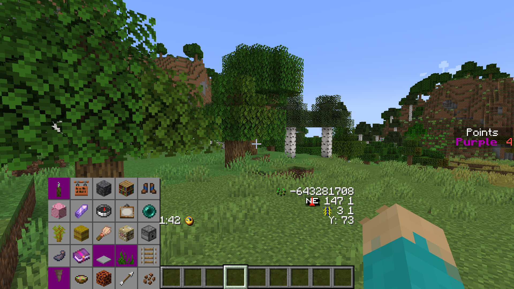
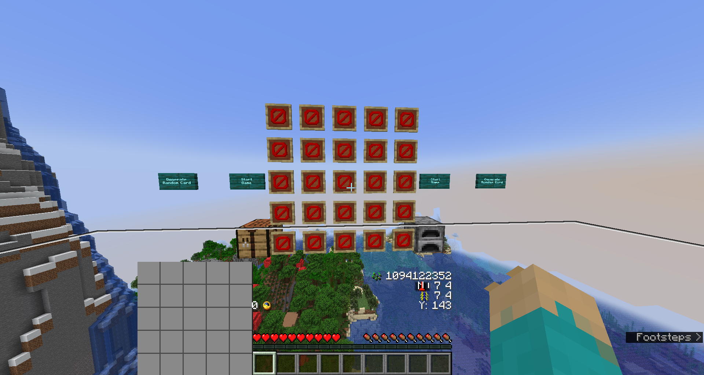
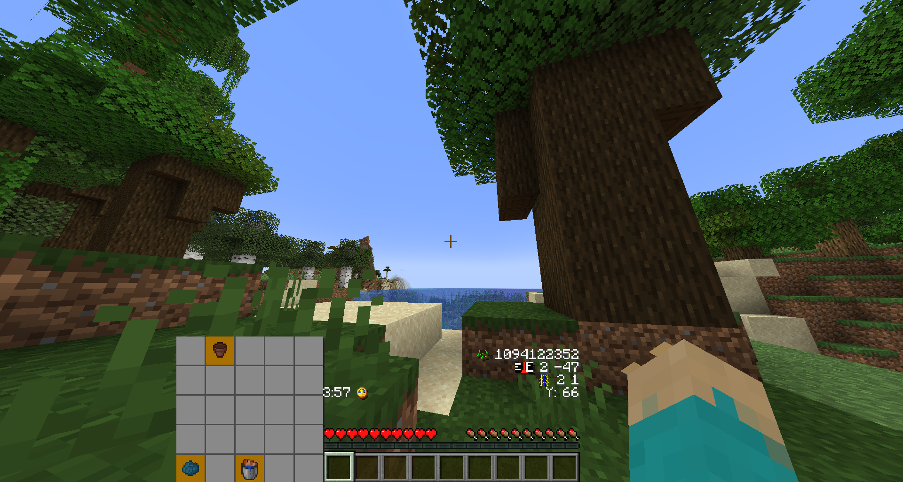
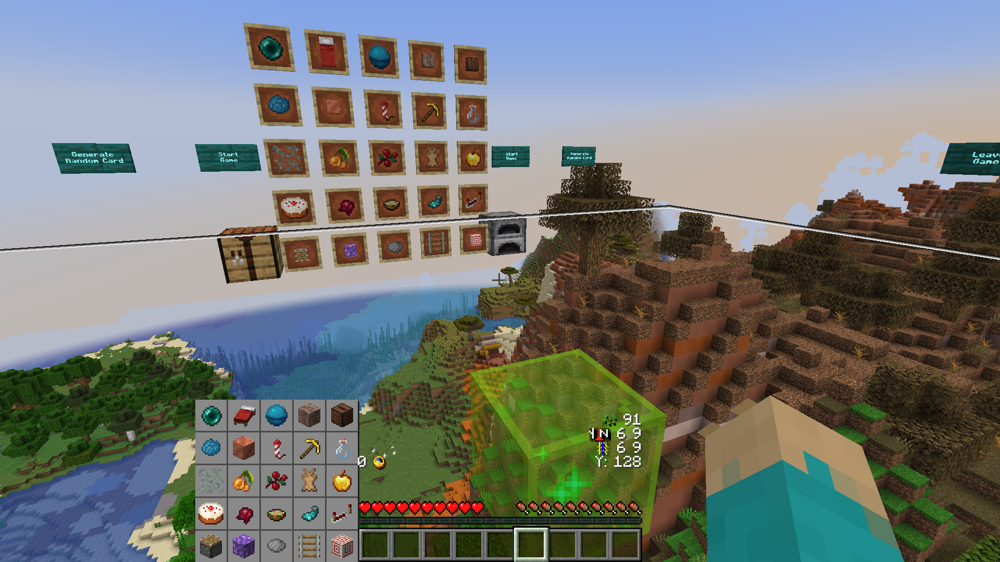
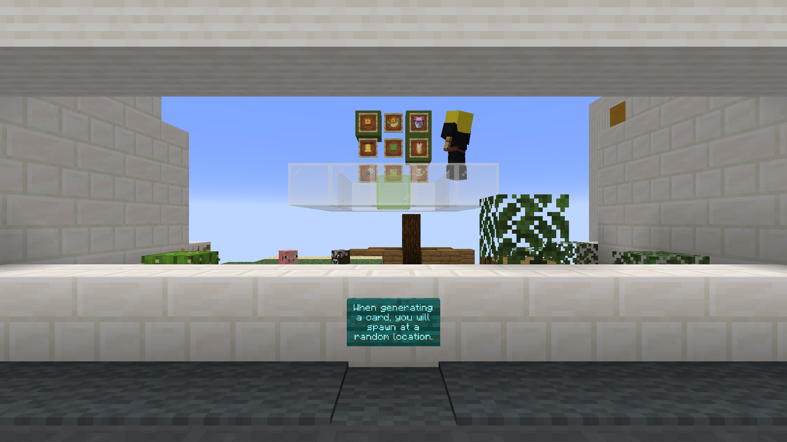
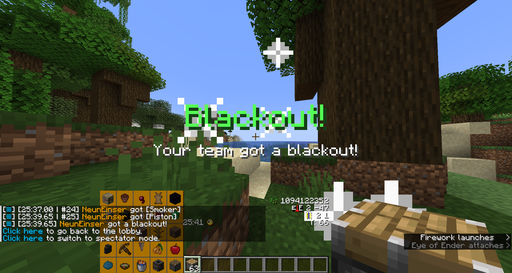

# 5.3.1
5.3.1 fixes an overlooked bug mis-detecting any tipped arrow as slowness or
poison arrow after reloading the game in 1.21-1.21.8; or in 1.21.9 and 1.21.10
if reloading the world during an active game.

This bug happened when the lobby is not the worldspawn (which is not supported
in early versions and in 1.21.9 and 1.21.10 will not be the case when a player
is playing inside an active game)

# 5.3

5.3 brings compatability with all Minecraft versions from 1.21 to 1.21.10,
brings support for updating a save file from a previous version, makes use of
the new dialog system, and as always adds new items available in more recent
Minecraft versions.

## Changelog
- Updated to 1.21.10
  - All versions starting from 1.21 are still supported
- It is now supported to update old Fetchr installations to the current release
  - Updating version 5.0.1 and prior is not supported and will print an error
    message.
  - 5.1, all its beta versions, and later is supported.
  - Instructions below.
  - It is also now always supported to change the Minecraft version without
    re-downloading Fetchr
- Updated the item pool
- Players now receive a spyglass in the spawn preview
- Added custom Fetchr options to main menu
- Added Quick Actions dialog
- Replaced some chat dialogs with new in-game dialogs when playing in 1.21.6 or
  later.
- Renamed “Blind Mode” to “Concealed Card”
- Renamed “Points Race” to “Target Time”
- Renamed “Preferences” to “Personal Preferences“ to highlight that these are
  settings that only apply to your player.
- Improved goal completion announcements
  - If you win and your team only has one player, all goal announcement title
    messages now say “You” instead of “Your team” (e.g. “You got a blackout!”)
  - When another team with only one player wins, all goal announcement title
    messages now say “<player name>” instead of “The ... team” (e.g. “NeunEinser
    got a blackout!”)
  - Target Time and Lockout Mode announcements titles now work like other
    announcement titles and say the team name if another team wins (or the
    player name).
  - Target Time and Lockout Mode now show a yellow title with a special message
    in case the game was tied (and you got the winning points).
  - Target time announcemnt titles now show the number of points the winning
    team achieved.
  - Target time announcements now have a special title announcement when playing
    in singleplayer: “You reached xx points” instead of “You won with xx
    points”.
- When a team has only a single player, the scoreboard on the right side of the
  screen will now show the player name instead of the team color.
- Credits for people that do not have a player head block now have a profile
  icon next to their name on the sign if their Minecraft in-game name is known.
- The worldspawn is no longer set in the overworld
  - During a game, it is set to the game dimension
  - When the last player returns to the lobby, or when first opening the world,
    it will be set to the lobby.
  - This also means compasses will now function like in vanilla and point
    towards the spawn point
- The datapack and resourcepack are now packaged in a way that they should
  always load and be able to spam an error message when trying to play in an
  unsupported version.
  - The error messages when playing in an unsupported version now tell you the
    supported version range exactly.
- Removed shadow behind icons in custom HUD
  - Text still has shadow for readability
  - This only applies for Minecraft version 1.21.4 and later.
  - This restores the HUD to what it used to look like in 5.0 (1.16)
- In 1.21.9, pvp is now disabled by default using a gamerule
- Removed Twitter link from Community & Support book
- Deactivated random ticks during the spawn preview phase
- Improved performance with team name calculation in spawn preview, and only
  update them when it's actually necessary
- Error logs caused by the datapack have been reduced
  - Only creating item frames in Minecraft versions 1.21.4 and lower still
    causes error logs.
  - Resolves [#294](<https://github.com/NeunEinser/bingo/issues/294>)
  - Fixed log error on first load due to missing DragonFight compound in
    level.dat
- Error message for spigot is changed.

## Updating a previous installation
Always do a backup of your world before updating! There is a chance of
corruption

- Make a backup
- Download the world download
- Unzip the zip file
- Copy and replace all files from the world download in your save file

### More information and caveats
When updating, player-placed blocks are preserved if possible, and dropped if
the original block has changed compared to the new lobby version. If the part of
the lobby has been entirely removed (like the machinery), blocks are dropped at
the lobby spawn, otherwise they are dropped were they used to be placed.

For Fetchr versions that still had the machinery, the lobby will be moved
slightly. In case there is a player-placed structure that partially intersects
with the bounding box of a lobby section, the lobby section including that part
of the player-placed structure will be moved, slicing the player-placed
structure.

If you create a backup, you can safely test how the lobby update treats your
lobby.

Entities that were changed will have their changed data updated, while
preserving any changes that may have been made by the player (like switching the
armor of an armor stand)

## Dialogs

### Quick Actions
A static quick actions dialog can now be accessed when pressing `G` by default
(see “Quick Actions” keybind in the Miscellenaeous section).

The Quick Actions dialog is only available when playing in Minecraft version
1.21.6 or later.

Quick actions allow:
- Genreate a random card
  - A confirmation dialog to end the game will be shown if the player is
    currently in a game
- Genreate a card from seed
  - A confirmation dialog to end the game will be shown if the player is
    currently in a game
- Return to Lobby or Join Game
  - If the player is in the lobby, attempts to join a game, otherwise returns to
    the lobby
- Enter Spectator Mode
  - During the game, allows to enter spectator mode
- Move Players to Lobby or Spawn Preview
  - During an active game, moves all players to the lobby
  - When the spawn preview is ready, moves all players to the spawn preview
- Reveal Bingo Card
  - During a Concealed Card run, reveals the Bingo Card.
- Change Settings (see below)
- Find links to the issue tracker, Discord, and Map Download sources

Since there is no way to make the Quick Actions screen dynamic, all options will
always be shown, even if they are not releveant.

You can also access the Quick Actions from the Fetchr Options screen, were they
will be dynamically adjusted to only show relevant things.

### Fetchr Options

In version 1.21.6 and later, all settings from the lobby have been added as a
custom main menu entry. You can still change settings in the lobby as well.

[](/images/5.3/main_menu_custom_options.png)
[](/images/5.3/fetchr_options.png)

### Game Settings

The game settings dialog lets you change all settings you can also access in the
lobby:

[](/images/5.3/game_settings_dialog.png)

The settings screen is be reduced when in single player just like the lobby is.

On a server, you may be prompted to confirm your operator status first before
being able to access this menu if operator-only controls are enabled.

### Confirm Operator status
In version 1.21.6 and later, the prompt to confirm your operator status is now
implemented as a dialog.

Additionally, the game now remembers the action you tried to perform and upon
successful confirmation executes that action without the need to click the same
sign again.

[](/images/5.3/confirm_operator_status_dialog.png)


### Generate Card from Seed

In version 1.21.6 and later, setting a seed is now done from a dialog. If you
prefer, you can still directly use `/trigger fetchr.seed set <seed>` as well
while in the lobby or the spawn preview area.

[](/images/5.3/set_seed_dialog_final.png)

### Target Time

In version 1.21.6 and later, setting a target time (previously “Points Race”)
now happens through a dialog.

[](/images/5.3/target_time_dialog.png)

### Pre-generation Radius

In version 1.21.6 and later, the selection of the area to pre-generate is now
implemented as a dialog.

[](/images/5.3/pre_generation_radius_dialog.png)

## Item Changes

### Leather Items
- Added Yellow Harness
  - Only available in 1.21.6 and later
- Added Saddle
  - Only available in 1.21.6 and later
  - Now craftable with 3 leather and 1 iron

### Lodestone
- New category
- Only available when playing 1.21.5
- Added Lodestone
  - was changed in 1.21.5 to use an iron ingot instead of netherite
- Added Lodestone compass
  - Also mutually exclusive with compass and map
  - Likelihood is split with compass in that category, making map still as
    likely as before

### Swamp
- New Category
- Only available when playing 1.21.5
- Contains existing items: slime ball, sticky piston, leash and poison arrow
- Added firefly bush

### Warm Biomes
- Added dead bush to this category (previously only categorized as "shearable")
- Added Cactus Flower
  - Only available when playing 1.21.5
- Added Short dry grass
  - Only available when playing 1.21.5
  - Also added to the shearables category

### Miscellaneous
- Added bush
  - Only available when playing 1.21.5
  - Mutually exclusive with other shearable items
- Replaced pale moss block with pale moss carpet
  - This is to make it easier to distinguish from tuff and other gray blocks
- Replaced moss carpet with moss block
  - Cannot be found in mangrove swamps, and only shipwreck food chests and lush
    caves
- Added copper lantern to the copper category
  - Only available in 1.21.9 or later
- Lead categories now depend on the Minecraft version
  - Moved lead from slime category to spider category in 1.21.6 and later
  - Now craftable with an additional string instead of slime ball in these MC
    versions
- Replaced blue trimmed leather boots with blue trimmed golden boots or blue
  trimmed copper boots when playing in 1.21.9 or later
  - This is to offset the leather usage from some of the newly added items

## Worldgen
- Made armadillos more likely in badlands in 1.21.5
  - Badlands can now spawn some warm farm animal variations, were previously
    only armadillos could spawn
  - This was adjusted the same way as savanna previously, meaning armadillos
    take up a bit over half the peaceful spawns in these biomes
- Worldgen is updated to match 1.21.5 when playing in this version
  - Most notably, pale gardens spawn about twice as often now

## Blind Mode -> Concealed Card
“Blind Mode” has been renamed to “Concealed Card”. This is to diambiguate it
with weekly “blind” seed challenges, which are played without knowing the card
beforehand.

## Bug Fixes
- Fixed lockout mode when playing with one team causing the colored card
  backgrounds of unlocked items to not show up properly
- Fixed players of the yellow team always getting the “Loser” notification when
  completing a Lockout or reaching the Target Time, even if they won.
- Fixed error chat spam not showing up when playing in a version that's too old
- Fixed resource pack check sign when joining a server for the first time with
  the resourcepack disabled not being lit up properly (mojank)
  ([#241](<https://github.com/NeunEinser/bingo/issues/241>))
- Fixed players not being assigned correctly when multiple buttons are pressed
  by different players in the same game tick
- Fixed compass player position icon showing colors that are slightly off (due
  to the image using an outdated palette)
- Fixed lodestone compass spinning in the spawn preview
- Fixed github link in the Community & Support book going to NeunEinser/fetchr
  rather than NeunEinser/bingo
  ([#266](<https://github.com/NeunEinser/bingo/issues/266>))
- Fixed pre-generation and target time signs not updating immediately after
  changing their value
- Fixed additional spaces in configure custom HUD chat menu
  ([#287](<https://github.com/NeunEinser/bingo/issues/287>))
- Fixed scaffoldings dropping when reloading (or regenerating the item pool
  display) if the item pool exceeds a certain size
  ([#301](<https://github.com/NeunEinser/bingo/issues/301>))

## Technical changes
- It is now fully supported for extension packs to alter or add to the lobby.
- During a lobby update, all marker entities inside a lobby structure may be
  deleted.
- The topmost item pool display chest is no longer forced to be a double chest,
  and may be a single chest depending on the item pool now
- Most of the data and resource pack are now disabled when playing in an
  unsupported version
  - The only exception to this is the languages from the resource pack, and the
    ticking function which is responsible for posting the error message
  - Everything in the build datapack and resoucepack is now part of an overlay
    and no longer inside the root `data` and `assets` directories, with the
    exception of language files.
- The HUD now updates after every reload and applies changes to selected
  components of players. New components are currently not automatically added.
  to existing player's HUDs as of now
- Images in the resourcepack are saved more efficiently now and have metadata
  stripped
- Release files now are generated with consistent meta contents, resulting in
  verifiable hashes when building locally 

### Registering a lobby structure

- Use fetchr:registries structures

- `id` - (namespaced id) The id of your structure file
- `override_id` (optional, namespaced id) Should be left empty for structures
  you define. Can be used to override a structure from a foreign pack (e.g.
  vanilla Fetchr) with a different structure file you define.
- `version` (int) The numeric version of the structure. Should be changed
  when your structure file is updated, so that the lobby can be updated.

  This should be unique for the combination of `id` and `override_id`.
- `entrance_position` int array of length 3. Indicates the position of this
  structure's entrance. If the x position is set higher than 1, it is currently
  not supported to have any blocks in front of the entrance.
- `after_structure` (optional, namespaced id) The id of the structure to place
  this structure after. This can be used to insert a structure after another
  known structure. If set, this structure will be placed after the existing
  structure, or a structure that has set the same `after_structure`.

  This should _not_ be set to a structure of your own pack. The order of your
  structures will be preserved. If you want to insert a structure after one of
  your own structures, simply set it to the same `after_structure` as the other
  structure and register it later.

Removing a structure after it has been added is fully supported (e.g. if your
pack is uninstalled).

### `#fetchr:lobby_update/manipulate_special_block` & `#fetchr:has_special_lobby_update_behavior` tags

During a lobby update, if a block was changed in your structure, this change
will be applied to the existing structure. In case this block has been altered
by the player, it will be dropped. This will do a strict comparision, including
nbt data and block states.

In some cases this can be too strict. For example, vanilla fetchr handles doors
and player heads specially, and makes sure doors that were only opened or
closed, and player heads that have additional data from a previous minecraft
version when profile data was still resolved and saved on the block are treated
equally.

You can add blocks you want to handle specially to the
`#fetchr:has_special_lobby_update_behavior` block tag. If you do this, in case
this block is detected altered, functions in the function tag
`#fetchr:lobby_update/manipulate_special_block` will be called.

`#fetchr:lobby_update/manipulate_special_block` context:
- location: This function will be executed at the location of the old block that
  has changed and will be dropped if there is a difference between this block
  and the previous unaltered structure
- macro arguments:
  - `reference_x`: The x location of the reference. The reference is an
    unaltered version of the lobby. This location will contain the unaltered
    block

You may alter either the block at the reference or the block that is compared
against to make them equal, preventing the block in the lobby from being
dropped.

You should check whether both the block in the reference and the old block are
a block you want to handle.

### `#fetchr:lobby_update/manipulate_updated_entity`

This function tag can be used to do additional changes to an entity after it
has been updated.

Context:
- current entity (@s): The entity that has been updated
- location: The location of the entity
- `@e[tag=fetchr.current_new]`: The unaltered new entity as it is defined in
  your structure

### `#fetchr:lobby_update/add_legacy_structures`

This function tag can be used to update a lobby of an older version of fetchr.

You do not need this for updating structures when using this version of Fetchr
or beyond. This is only for updating lobbies from 5.1-beta1 - 5.3-beta5.

Add the structures that would have been there in your version configured
correctly to storage `io.fetchr:structures structures`.

`id` should be the namespaced id of the structure which matches the structure
file of the new structure.

`entrance_position` should be the entrance position according to the old
structure

`legacy_id` should be the id of the structure file which produces the structure
as it has been part of the old lobby

### `#fetchr:lobby/generated`

This function tag is called after the lobby has been genreated either for the
first time, or a lobby update has been completed.

Use this to e.g. spawn marker entities. Make sure your marker entity doesn't
exist already from a previous generation.

You should also run this function when your datapack is loaded for the first
time and the score `$lobby_genreated` in `fetchr.state` equals 4.

### Other new function tags

- `#fetchr:goal_and_item_detection/achieved_goal`: Any goal has been achieved
  - `@s`: Player who got the last item
  - `@a[tag=fetchr.in_current_team]`: Players who are in the team achieving the
    goal
  - storage `io.fetchr:find_team current_team` the current team data
- `#fetchr:goal_and_item_detection/achieved_20_no_bingo`
  - `@s`: Player who got the last item
  - `@a[tag=fetchr.in_current_team]`: Players who are in the team achieving the
    20 no bingo
  - storage `io.fetchr:find_team current_team` the current team data
- `#fetchr:goal_and_item_detection/achieved_bingo`
  - `@s`: Player who got the last item
  - `@a[tag=fetchr.in_current_team]`: Players who are in the team achieving the
    bingo
  - storage `io.fetchr:find_team current_team` the current team data
- `#fetchr:goal_and_item_detection/achieved_blackout`
  - `@s`: Player who got the last item
  - `@a[tag=fetchr.in_current_team]`: Players who are in the team achieving the
    blackout
  - storage `io.fetchr:find_team current_team` the current team data
- `#fetchr:goal_and_item_detection/achieved_lockout`
  - `@s`: Player who got the last item
  - `@a[tag=fetchr.in_winning_team]`: Players who are in a team winning the
    lockout race. Maybe players of multiple teams in case of a tie.
  - storage `io.fetchr:find_team current_team` the current team data
- `#fetchr:goal_and_item_detection/finished_points_race`: The points race ended.
  - `@a[tag=fetchr.in_winning_team]`: All players who were in a winning team
- `#fetchr:goal_and_item_detection/item_detected`: A player got an item that is
  on the card. The item announcement has not happened yet.
  - `@s`: The player who got the item
  - `@a[tag=fetchr.in_current_team]`: All players who are in `@s`' team
  - `io.fetchr:find_team current_team`: Team id color, and other team data
  - Macro parameters according to `::fetchr::storages::card::CardSlot`
  - Slot information also available in storage using a macro as
    `fetchr:card slots[$(slot_id)]`
- `#fetchr:goal_and_item_detection/item_get_announced`: Player @s got 
  an item that is on the card and the announcement has been made.
  - `@s`: The player who got the item
  - `@a[tag=fetchr.in_current_team]`: All players who are in `@s`' team
  - `io.fetchr:find_team current_team`: Team id color, and other team data
  - Macro parameters according to `::fetchr::storages::card::CardSlot`
  - Slot information also available in storage using a macro as
    `fetchr:card slots[$(slot_id)]`
- `#fetchr:game/tick` Ticking function that is called while a game is in
  progress
- `#fetchr:lobby/tick`: Ticking function that is called while the lobby is
  loaded by at least one player
- `#fetchr:spawn_preview/tick`: Ticking function that is called while the spawn
  preview is available
- `#fetchr:player_tick`: Ticking function that is called for every player
  - `@s`: The current player who is in the lobby
  - Position: Function is executed at the player's location
- `#fetchr:game/player_tick`: Ticking function that is called for every player
  in a running game
  - `@s`: The current player who is playing in the game
  - Position: Function is executed at the player's location
- `#fetchr:lobby/player_tick`: Ticking function that is called for every player
  - `@s`: The current player
  - Position: Function is executed at the player's location
- `#fetchr:spawn_preview/player_tick`: Ticking function that is called for every
    player in the spawn preview
  - `@s`: The current player who is in the spawn preview
  - Position: Function is executed at the player's location
- `#fetchr:spawn_preview/created`: The spawn preview area has been created
  - Position: Function executed at the center of the spawn preview
- `#fetchr:spawn_preview/player_entered`: Player entered the spawn preview
  area
  - `@s`: Player who entered
  - Position: Function executed at spawn preview center
- `#fetchr:spawn_preview/teleported_all_players`: All players have been
  forcefully teleported to the spawn preview area
  - `@s`: Player who triggered the teleport
- `#fetchr:spawn_preview/joined_team`: During the spawn preview phase, a player
  has joined a team.
  - `@s`: Player who joined the team
  - Team color available from @s[team=fetchr.color] from this point onward.
- `#fetchr:start_sequence/start_sequence`: The “start game” sign has just been
  activated, and the spawn sequence starts
  - `@s`: Player who activated the sequence
  - Position: The center of the spawn preview
- `#fetchr:start_sequence/players_start_falling`: Players start falling as part
  of the spawn sequence
  - @e[type=minecraft:marker, tag=fetchr.spawn, limit=1]: Marker for position
    at the top of the drop chute
- `#fetchr:start_sequence/all_players_landed`: Players landed as part of the
  start sequence
  - Position: The location on the ground that will become the spawn point.
- `#fetchr:start_sequence/advance_countdown`: Countdown before a game starts
  decreases
  - @e[type=minecraft:marker, tag=fetchr.spawn, limit=1]: Marker at the location
    of the spawn point.
- `#fetchr:start_sequence/countdown_ended`: The countdown ended and the game
  starts
  - Position: The location on the ground that will become the spawn point.
- `#fetchr:game/ended`: A card generation was requested, and the current game
  has ended (players returned to lobby, game state changed, etc). The card
  generation will take place after this tag has been called.
- `#fetchr:game/revealed_concealed_card`: While the concealed card setting is
  active, player `@s` has revealed the card.
- `#fetchr:game/joined_as_spectator`: Player `@s` has entered a running game as
  a spectator
- `#fetchr:dialog/add_to_quick_actions`: The dynamic Quick Actions dialog
  acessible from the pause menu under Fetchr Options is about to be generated.

  Use this tag to add your own Quick Actions.

  Note that this is not related to the Quick Actions dialog accessible from the
  `G` hotkey
  - storage `io.fetchr:dialog dialog`: The dialog to show to the user. This is
    always a type `multi_action` dialog.
- `#fetchr:lobby/player_returned`: Player `@s` has returned to the lobby
- `#fetchr:lobby/teleported_all_players`: All players have been forcefully
  teleported to the lobby
  - `@s`: Player who activated the teleport
- `#fetchr:confirmed_operator_status`: Player `@s` has successfully confirmed
  their operator status
- `#fetchr:lobby/before_item_pool_chest_incremented`: During item pool chest
  generation, a new chest is about to be added
  - Position: The location at the bottom of the chest stack and the lower z
    coordinate
  - Macro parameter `height`: The current height of the chest stack
- `#fetchr:lobby/item_pool_chest_incremented`: During item pool chest
  generation, a new chest has been added
  - Position: The location at the bottom of the chest stack and the lower z
    coordinate
  - Macro parameter `height`: The current height of the chest stack
- `#fetchr:lobby/item_pool_chests_generated`: The item pool chest generation has
  completed
  - Position: The location at the bottom of the chest stack and the lower z
    coordinate
- `#fetchr:hud_component_updated`: A HUD component has been updated after a
  reload. You can do custom updates for your components here to support older
  versions of your pack being updated
  - storage `io.fetchr:custom_hud custom`: The custom part of the component.
- `#fetchr:item_pool_changed`: The item pool has changed.

### Item pool registrations
- Removed `fetchr:negated_component` item_test
- Added `fetchr:component_exists` item_test also supporting negated funcionality
- Category lists now support a mixed typed list

#### `fetchr:component_exists` item_test
New item test that can bes specified in the item pool to check for an item
component to exist

- Requires the item component to exist on this item, with any contents
- `id` - The item component id
- `negated` - Optional. When set to `true`, requires the component to **not**
	exist (same as previous `fetchr:negated_component`)

### Heterogeneously typed category lists
When registering items, category lists can now be heterogeneous in 1.21.5 (in
1.21.4, this would be an SNBT syntax error)

This means instead of specifying a compound with only an id and no weight, you
can now always specify a string, even when there is another compound in the same
list

For example, `[ {id: "fetchr:pumpkin" }, {id: "fetchr:egg", weight: 2 } ]` can
now be written as `[ "fetchr:pumpkin", {id: "fetchr:egg", weight: 2 } ]`

### Text Components
In accordance with the 1.21.5 changes, text components are now in SNBT format
and no longer stored as stringified JSON in Minecraft versions 1.21.5 and
later

This affects all storages that stored text components before.

# 5.2.2
5.2.2 is released to address yet another critical bug in 5.2.x that can cause
entities to stay frozen when altering render distance before the game starts.

This version is fully compatible with 5.2 and 5.2.1, meaning you can keep the
same server config and just replace the datapack without replacing the world.

## Bug Fixes
- Fixed entities outside of render distance staying frozen when lowering render
distance

# 5.2.1
5.2.1 is released to address a critical bug in 5.2 that could cause spawn points
to be swapped and mangled after playing multiple runs. You are highly encouraged
to update.

This version is fully compatible with 5.2, meaning you can keep the same server
config and just replace the datapack without replacing the world.

## Bug Fixes
- Fixed spawn marker not being cleared properly after a run, causing
spawn points to be potentially swapped and messed up.

# 5.2
5.2 updates the map to 1.21, brings new items, and a few improvements

## Changelog
- The targeted Minecraft version is now 1.21-1.21.4
- Added new items and changed categories of existing items
- Worldgen Tweaks
- Armadillos are more common to generate in savanna biomes compared to vanilla
- Items taken from the game that include an inner inventory now return their
inventory to the player
  - This includes bundles, shulker boxes and loaded crossbows
- Item get messages in chat now contain a tooltip with the exact item that was
taken
- Improved category chest
- Improved big lobby & skybox card interaction
- Creepers and tnt no longer cause damage in the lobby
- Technical Improvements and better Performance
- Removed machinery as command blocks are no longer necessary
  - Command blocks are no longer required to be enabled in a server environment
- Updated translations from Crowdin
- 1EEFEzBzXBZzUPzCSJOHzNPSFzNPCTzUPzUIFzMPCCZAz3BNFMT1SFiIF2FTUAz7PzUPzUIFzHJUIVCAz7PzUPzDPEFAz3MJDLzPOzUIFzJNBHFTzEJSFDUPSZAziBLFzBzMPPLzBUzuArAz8PQFzUIJTzIFMQTAzLBZzCZF
  - sorry this got corrupted
  - dont worry about it
  - possible characters are `[a-zA-Z0-9 .]`

## Item Changes

### Roots
New category "Roots" with:
- Carrot
- Golden Carrot
- Carrot on a Stick
- Baked Potato

### Armadillo
New "Armadillo" Category with:
- Armadillo Scute
- Wolf Armor

### Pale Garden
New category "Pale Garden"  
These items are only available when playing in 1.21.4

- Pale Moss Block
- Closed Eyeblossom
- Open Eyeblossom
- Pale Hanging Moss (also mutually exclusive with shear items)
- Resin Clump (also mutually exclusive with nighttime mob drops)
- Chiseled Resin Bricks (also mutually exclusive with nighttime mob drops)
- Creaking Heart (also mutually exclusive with nighttime mob drops)

### Other new items
- Jungle Sapling as part of the jungle category
- White Stained Glass exclusive with glass bottle and orange concrete
- Brown Banner as part of the wool category
- Light Blue Bundle as part of the leather category
  - This is only active in 1.21.2 or higher
- Added Poison arrow which splits its weight with slowness arrow

### Changes
- Book items have been separated from the leather category and are no longer
  exclusive with item frames
- Tnt and Tnt Minecart are no longer exclusive with glass bottle and orange
  concrete
- Saplings are no longer mutually exclusive
  - Mangrove propagule is exclusive with mud items
  - spruce sapling is exclusive with sweet berries, fern and snow
  - acacia is exclusive with cactus green, lime dye and sea pickle
  - dark oak is exclusive with apple and golden apple

### Removed Items
- Birch sapling
- Golden hoe, golden pickaxe
- Diamond shovel, diamod axe, diamond sword

The variety in gold and diamond tools was reduced to make blind runs need to
craft fewer of them.

## Lobby & Skybox
- The machinery is gone, as command blocks are no longer needed
- Removed the floating property in front of the big lobby & skybox card
- The reach to interact with item frames and other entities is now increased
while in the lobby or skybox.
- Item chests in the lobby now show the global item weight.
- Item chests in the lobby now generate with scaffolding and make the room grow
in height depending on the item pool (without pale garden items, the room is
shorter, for example.)

## Worldgen Tweaks

-  Buried treasure is now more common like other structures
  - This means map chests are now less likely to have no map
  - Buried treasure will generally be closer to their map
- Pillager outposts now require less distance from villages
- Trial chambers are more common, just like other structures in Fetchr
- Creaking heart frequency in pale oak trees has been increased compared to
vanilla from 10% to 35%

## Technical Changes
- Overhauled item registration card generation and item detection with new
  Minecraft Features in Mind such as Macros

### Item Registration
Item registration has been overhauled and existing forks that change the item
pool will need to update to the new system.

- `textComponent` has been removed
- `clearCommand` has been removed
- `detectCommand` has been removed
- `icon` is no longer a text component and instead the 4 digit hex code of the
  unicode character representing the item on the HUD bingo card
- `icon_font` specifies a own custom font to use for this item. Can be used to
  avoid conflicts in the vanilla Fetchr font files when maintaining forks
  - `actionbar` A list of 5 font definitions to use for the card displayed in
    the actionbar. Each definition is for a different row on the Bingo card
	 and needs to have the corresponding ascend value set. Reference the vanilla
	 Fetchr assets.
- `translation` New property for the translation key of the item
- `item_tests` Optional. Can be used for custom item tests.
  - `type` see blow
  - Type specific fields (see below)

#### Item Tests
Item tests can be used to further specify an item or override default behavior.
By default, any item in the `item` field will match, including any defined
components.

If `item_tests` is specified the components of the item definition will be
ignored for testing purposes and only be used to construct a display item
for the item frame card or the category chests.

- **`fetchr:component`**  
  A component the item must have exactly like specified.
  - `id` The data component id
  - `component` The component value
- **`fetchr:negated_component`**  
  A component the item must not have
  - `id` The data component id
- **`fetchr:predicate`**  
  An item sub predicate that must succeed for the item
  - `id` The item sub predicate type
  - `predicate` The predicate data

At runtime, this will be parsed together with the item id into a command item
argument.

For example this definition would leather boots with a blue shaper trim which is
not shown in the tooltip and a custom lore text whenever it is displayed, and
any leather boots that have any kind of blue trim would match:
```js
{
	item: {
		id: "minecraft:leather_boots",
		components: {
			"minecraft:trim": {
				pattern: "minecraft:shaper",
				material: "minecraft:lapis",
				show_in_tooltip: false
			},
			"minecraft:lore": [
				'{"translate": "item.minecraft.smithing_template.upgrade", "color": "gray", "italic": false}',
				'[" ", {"translate": "fetchr.item.description.any_trim", "color": "#406d95", "italic": false}]',
				'[" ", {"translate": "trim_material.minecraft.lapis", "color": "#406d95", "italic": false}]'
			]
		}
	},
	item_tests: [
		{
			type: "fetchr:predicate",
			id: "minecraft:trim",
			predicate: {material: "minecraft:lapis" }
		}
	]
}
```
When testing the item id together with the specified item tests would check for
`minecraft:leather_boots["minecraft:trim"~{material:"minecraft:lapis"}]`

### Renamed properties in storages
Properties in the item storage and the card storage have been renamed to follow
`snake_case` convention.

### Item Detection & Performance
The machinery room is obsolete now and has been removed. Item detection has
been fully implemented using macros and no longer needs any command blocks.

This should improve the performance quite significantly, as running command
blocks every tick was quite expensive.

Item detection now only runs for a player who had a change to their inventory
and does not have any active checks that run every tick anymore.

Command blocks are also more expensive because they parse their command
every time they are executed anew while functions are pre-parsed. Macro lines
still may need to be parsed more often, but because of macro caching, they will
only need to be re-parsed when a new card with different items is generated.
The cache only caches up to 8 unique combinations of arguments per function file
which means some functions have been duplicated to take advantage of the cache
for 25 items. There will still be a small performance overhead for cache lookup.

### Card Generation
Card generation also could be simplified using macros. Furthermore, there is no
custom random number generator in place anymore, and instead the built-in
`random` command is used.

## Bug Fixes
- Fixed Green Dye having the wrong internal id of `fetchr:lime_dye` (#236)
- Fixed spawning inside leaves in some spawn points
- Fixed vines not getting replaced by drop chute
- Fixed old skybox remaining when generating new card
  - This would lead to a black box hovering underneath the spawn point when
  re-generating a card with the same seed again.


# 5.1.3

5.1.3 fixes a critical overlooked bug in 5.1.2 causing a game to not start
properly in 1.20.5 when standing close to the big skybox card when starting the
game

## Changelog
- Fixed players keeping no gravity when standing close to the skybox card when
starting the game, preventing them from falling and the countdown from starting
- Fixed /trigger fetchr.lobby being disfunctional during the game initialization
phase
- Improved overlay generation to give the game a unique file override per
Minecraft version

# 5.1.2

This release brings some quality of life improvements, bugfixes, and 1.20.5
support

## Changelog
- Added support for 1.20.5
- Added points scoreboard on the right (1.20.3+ only)
- Added points race goal
- Added option to join as spectator during game
- Added an error message when attempting to run in an unknown future version
- Added an error message when running on Spigot or Paper

## Points scoreboard
During the game, the points of each team are now shown on the right



The own team shows up in bold.

This feature is only available from Minecraft versions 1.20.3 and onward and is
disabled in earlier 1.20 versions.

## Points Race
The points race is a new mode, where you set a certain cut-off time and when
that time is over, the team(s) with the highest score win. It can be a nice
balance when you don't like going for all items in a potentially very long run,
but also consider a Bingo too fast.

This also helps for keeping track of the 25 minute challenge in weekly seeds.

## Translations
- Added Korean Translations by 쪼상 (wx2htkd)

## Bug Fixes
- Fixed spawning over flowing lava leading to a potential death loop (#210)
- Fixed fire spreading during the skybox phase
- Fixed spawning in powdered snow without a save block
- Fixed card frames sometimes starting to pop off in the skybox
- Fixed a sign in the lobby sometimes popping off when relogging.
- Fixed some /trigger commands not getting deactivated when joining the skybox
or joining the game late as a spectator

# 5.1.1
This release reverts an accidental change in the release causing the red team to
always be registered.

# 5.1

This version updates to Minecraft 1.20.2 and comes with new game modes, a new
skybox, and a lot of other changes.

## Changelog

- Updated to 1.20
- Added Blind Mode
- Added Lockout Mode
- Added timer options
- Added terrain preview and extended skybox to give the player a spawn preview
as soon as possible
- Updated lobby tutorial
- Added separate multiplayer settings room
- Removed team controls from the lobby
- Tweaked worldgen to be more balanced
- Updated item pool
- Spawn points can now only generate in a radius of 25 million blocks (down from
~30 million)
- Better multiplayer game controls
- Improved terrain pre-generation
- Removed emerald detection
- All loot sequences are now deterministic, meaning everyone playing the same
seed will have the same drop rates for mob drops, or random block drops (e.g.
flint)
- Slightly reduced brightness in caves compared to 5.0
- Quality of life changes
- Added new translations
- Added separate build for Minecraft Realms
- Technical changes

## Blind Mode
In blind mode, you cannot see the items on the card until any team obtained the
item.

When active, the Bingo card looks blank initially.

Knowing which items are mutually exclusive will help when playing this mode (see
category chests)

[](images/5.1/blind_mode_skybox_card.png)
[](images/5.1/blind_mode_run.png)

When playing blind mode, you can give up by revealing the card (and continue
getting what you missed if you want to)

## Lockout Mode

In lockout mode, each item can only be unlocked by one team, locking out all
other teams from obtaining the same item.

This also comes with a special goal which is announced when a team has obtained
more items than any other team still can at that point. It is possible for
multiple teams to have the same amount of items with no item still being
available, in which case all teams which share that item amount are announced as
winners.

In this mode, the Bingo card will highlight the entire square in the team color
just like with a single team.

Lockout mode is not available in single player.

## Timer
The timer will now pause when you pause the game. There is a setting to count
paused time again enables the same behavior as previous versions.

Additionally, an option for using in-game time has been added. The default is
still real time as before.

When using in game time, the counted time progresses as the in-game day
progresses. This means, a Minecraft day is always assumed to last exactly 20
minutes, regardless of lag.

In a competitive scenario, players who experience lag may be at a disadvantage,
as it takes longer for night time to arrive, or furnaces to smelt, and exploring
might also be harder if chunks don't load properly.

When using in game time, players who experience lag might be at an advantage
however, when they stay in a small area, as they can run through caves quicker
with less time being counted.

## Skybox
As soon as the game is ready, you will see a preview of the spawn point now. On
multiplayer servers only the player who generated the card automatically joins,
other players need to join.  
Only players who have joined will participate.  
[](images/5.1/skybox.png)


### Joining

For manually joining, the sign which was previously used for starting the game
has been swapped for a "join game" sign.

When joining, players are now assigned a random team, printing a message when
joining.

The relative position from the lobby compared to the big lobby card is kept.

Items marked on the lobby card by left and right click are copied to the skybox
when a player enters the skybox while no other player is there yet.

### Rejecting a Card / Spawnpoint

The skybox contains a "Generate Random Card" sign to reject the card and get a
new seed, just like when generating from the lobby. When this is done, the old
skybox is encased in black blocks until the new spawnpoint is ready, and players
are teleported over.

## Worldgen Changes
Worldgen has been updated for 1.20 and is based on the vanilla biome layout now.

### Biome layout
In contrast to version 5.0, it is now possible to use the vanilla biome layout.
This means, that biomes are placed exactly like in normal Minecraft, only their
size has been reduced.  
The width of beaches has been slightly increased compared to what it usually
would be with tiny biomes.

### Structures
Mineshafts are now included in worldgen again.

All structures generate with higher frequency compared to vanilla now, and
dungeons generate less commonly compared to 5.0, with the same frequency
increase as other structures.

## Item Changes
### Removed items
- Saddle
- Nametag

### Lush cave

- Spore Blossom
- Flowering Azalea
- Moss Carpet
- Rooted Dirt
- Hanging roots
- Glow Berries
- Axolotl Bucket
- Big Dripleaf

Lush caves can be found either by finding an azalea tree, or in general in the
center of a bigger moist biome (i.e. taiga, dark forest, (non-sparse) jungle;
or less-commonly windswept forest or wooded badlands)

### Dripstone cave

- Pointed Dripstone
- Dripstone Block

Dripstone caves can be found very in-land (far away from oceans), i.e. in the
center of a land mass

### Copper

- Raw Copper Block
- Copper Block
- Exposed Cut Copper
- Brush

Exposed copper needs to be placed for some time to change its state. In case it
oxidizes too much, it can be turned back by one state at a time using an axe.

It is beneficial to place more blocks at once with a distance of at least 4
blocks taxicap. With a stonecutter, you get 4 cut copper blocks per 9 copper
ingots.

### Deepslate

- Deepslate
- Cracked Deepslate Bricks
- Deepslate Tile Wall
- Tuff

Deepslate can be found below around y 0. Mining deeplsate gives cobbled
deepslate, cooking it in a furnace gives the normal deeplsate block.

Tuff can be found as blobs in the deepslate layer.

### Mud

- Packed Mud
- Muddy Mangrove Roots
- Mud Bricks

Mud can be found in mangrove biomes, or gotten from regular dirt using a water
bottle. Packing requires a single wheat (so the bricks require 4 wheat total).
The muddy roots can only be found in a mangrove swanp directly.

### Amethyst items
- Amethyst Shard
- Spyglass
- Amethyst Block
- Calcite

Amethyst needs a geode to be found. Geodes are generated with higher frequency,
like structures. It is usually easier to find them in the ocean, especially when
there is an aquifier.

Calcite can also be found in stoney peaks.

### Glow ink

- Glow ink sac
- Glow item frame (also mutually exclusive with regular item frame)

Glow ink can be gotten from glow squids who spawn in dark water basins. The glow
item frame is also mutually exclusive with other leather-related items


### Cherry items

- Cherry Chest Boat
- Pink Petals
- Cherry Sapling

Cherry Blossom is a new mountain biome. These items can be found there.

### Additions to existing categories

- Raw Gold Block (mutually exclusive with other gold items; and magma block)
- Raw Iron Block (mutually exclusive with basic iron items (iron block,
cauldron, stonecutter and acacia hanging sign))
- Mangrove Propagule (mutually exclusive with other saplings)
- Glow Lichen (mutually exclusive with other shearables like fern, dead bush,
...)
- Blue Trimmed Leather Boots (mutually exclusive with heart of the sea and
emerald)
- Hanging Acacia Sign (mutually exclusive with basic iron items (raw iron block,
iron block, cauldron, stonecutter))
- Dried Kelp (mutually exclusive with dried kelp block)

### Item Changes
- Enchanted book is now mutually exclusive with diamond items
- Stonecutter and dried kelp block are now no longer mutually exclusive
- Stonecutter is now mutually exclusive with other "basic iron" items (Acacia
Hanging Sign, Raw Iron Block, Iron Block, Cauldron)
- Added new kelp category with dried kelp and dried kelp block
- Piston and sticky piston are no longer mutually exclusive with redstone block
and repeater
- Renamed "Common Burried Treasure Loot" to "Shipwreck Loot"

## Lobby Changes
- Removed team selection in favor of the team selection in the skybox.
- Players have no longer a team in the lobby by default.
- The lobby has now a special area for some multiplayer settings that is only
accessible in multiplayer.
- The mocked skybox has now been updated to a miniature version of the new
skybox with some miniature terrain



### Multiplayer Controls
The multiplayer "strict mode" sign  was split into "operator-only" and "lobby
gamemode" controls for more intuitiveness. In oprator-only, only operators will
be able to interact with game controls like starting a game, revealing a card in
blind mode, etc. The lobby gamemode controls whether players are in adventure or
survival mode.

New options for disallowing spectator mode and hiding the seed from all players
until the end of the game have been added. This does not affect the existing
preference setting to hide the seed until the end of the game. This can prevent
some forms of cheating if you do not trust your players. The default is still
spectator mode enabled and seed shown.

There is also a success message being printed now for players successfully
confirming their operator status. In case the confirmation fails, just the
standard Minecraft "You do not have permissions to run this command" is still
shown as before.

Most multiplayer controls are in an entirely separate area now which is not
accessible in single player.

### Credits
- Removed "Used Tools" section
- Added "Special Thanks" section (including toolmakers)
- Moved Alpha testers to the front
- Moved translators to the back
- Removed credits for AmberW's negative space font as it is no longer used

## Pre-generation Changes
Pre-generation now only generates a minimal amount of chunks by default. This
means you have to wait less time to start a game.

In multiplayer, there are options now to pre-generate a certain radius of chunks
for lag reduction purposes.

After pre-generation has generated the minimal area, all entities that were not
present during generation are killed periodically every 3 seconds.

Pre-generation has a limit now on the amount of chunks that can be generated
ahead of fully loaded chunks

## Quality of Life Changes
- Added error message in place of custom HUD when resource pack is not enabled
- Added better announcement for goals and sound when enemy team completes a goal

### Better Goal Announcements
Whenever any team completes a blackout, 20-No-Bingo, or wins the lockout race, a
title announcement is now shown to all players, making it more obvious. This
also comes with a sound effect.

Bingo is not announced that way for now and does not cause a sound effect.

[](images/5.1/blackout_announcement.png)

## Added new translations

- Chinese (simplified) -- Thanks to 雨夢 YoMon and Sora
- Spanish -- Thanks to Alvaro Orrego and HolaSoyElmo

## Technical Changes
### Reduced available terrain / Timer now uses global world border
The timer is implemented using the world border, since it uses real time.

In previous versions of Minecraft, there was a (buggy) world-border per
dimension, which would reset when re-loading the world. While the game was
running, it was still possible to use it for timing tho. In previous versions,
the world border of the lobby dimension was used, which meant the complete world
with radius 30 million was available in the dimension where you played the game,

Now, the world border of the game world is always something between +-25 million
and 27.5 million blocks out (compared to +-30 million). Because of this, spawn
points are slightly closer together now.

### Switched Source License to MIT
Basically, you can do anything now as long as you provide attribution.

### Misc
- Replaced area effect clouds with markers
- Changed approach to setting signs in the lobby
- Changed namespace from "bingo" to "fetchr"
- Removed periodic clearing of the tmp scoreboard

## Realms Build
- Resource pack check is always skipped
- Always behaves like in multiplayer
- Uses survival mode in the lobby like singleplayer
- Doesn't include multiplayer advanced settings 

## Bugfixes
- Fixed a bug in how random numbers in the seeded generator where created
- Fixed strict mode sign sometimes appearing in single player
- Fixed entities right at the spawn block suffocating at the game start (#202)
- Fixed items being possible to be picked up before the game starts (and then
being cleared) (#203)
- Fixed category chests not generating when first opening the world
- Fixed command block enabled check not working properly in some server
environments (mainly Spigot/Paper, those are still not supported, tho it looks
like 1.20 versions _mostly_ work)

# 5.0.1

While I'm working on a 1.19 version, this is a release to improve performance
and address some configuration issues for server administrators.

## Changelog
- Added option to force adventure mode in the lobby without also restricting
game controls to admins
- On servers, adventure mode in the lobby is now Default
- Performance improvements
- Added French and Portuguese (BR) community translations
- Fixed bubble columns not getting replaced with dirt below spawn

# 5.0

Initial version for Minecraft 1.16.5